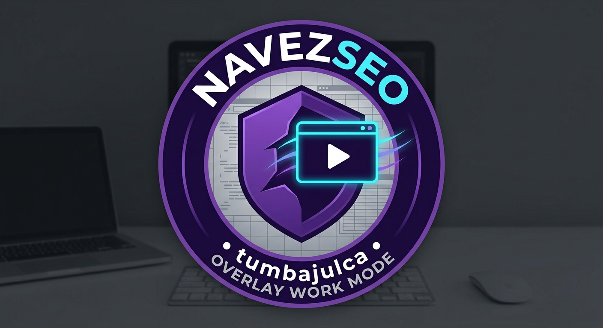

# 🚀 Stremio Overlay Work Mode (PiP Avanzado)

Este es un add-on avanzado para Stremio que te permite llevar tus streams a una ventana flotante (Picture-in-Picture), **encima de todas tus aplicaciones**, para que puedas ver contenido mientras trabajas.

## ✨ Características

* 🖥️ **Modo PiP Avanzado:** Un icono dedicado para activar/desactivar la ventana flotante.
* 👻 **Controles de Opacidad:** Slider para hacer el video semi-transparente y no distraerte.
* ⚙️ **Selector de Calidad:** Cambia la fuente del stream si el add-on de origen lo permite.
* 🤖 **Auto-PiP:** El video entra en modo flotante automáticamente cuando comienza la reproducción.
* 🌙 **Filtros de Descanso Visual:** Aplica filtros (Ámbar, Verde, Gris) para reducir la fatiga ocular.

## 🛠️ Instalación (Como cualquier Add-on)

1.  Copia esta URL: `stremio://tu-usuario.github.io/tu-repo/manifest.json`
2.  Abre Stremio.
3.  Ve a la sección de **Add-ons**.
4.  Pega la URL en la barra de búsqueda y haz clic en **Instalar**.

---

## 💻 Desarrollo y Despliegue en GitHub Pages

Este proyecto es una aplicación web estática diseñada para funcionar como un add-on de Stremio.

1.  Clona este repositorio.
2.  Realiza tus cambios en `manifest.json` e `index.html`.
3.  Sube los cambios a GitHub.
4.  En la configuración del repositorio (**Settings > Pages**), activa GitHub Pages apuntando a la rama `main`.
5.  Tu add-on estará disponible en `stremio://tu-usuario.github.io/tu-repo/manifest.json`.

---

© 2024 TU_USUARIO - Licencia MIT
